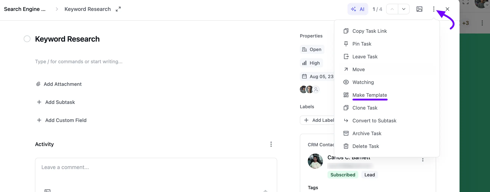
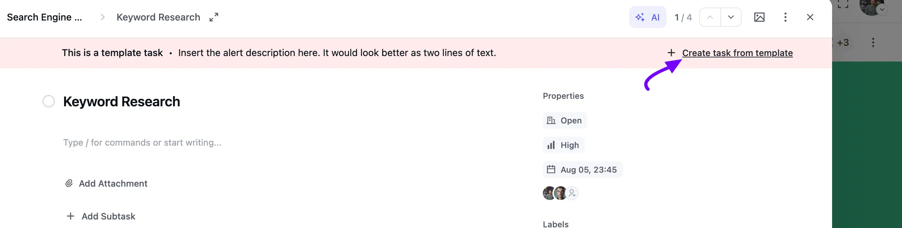
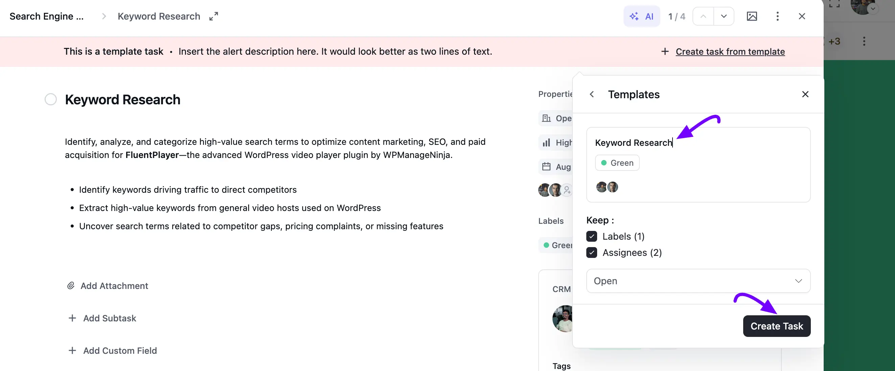
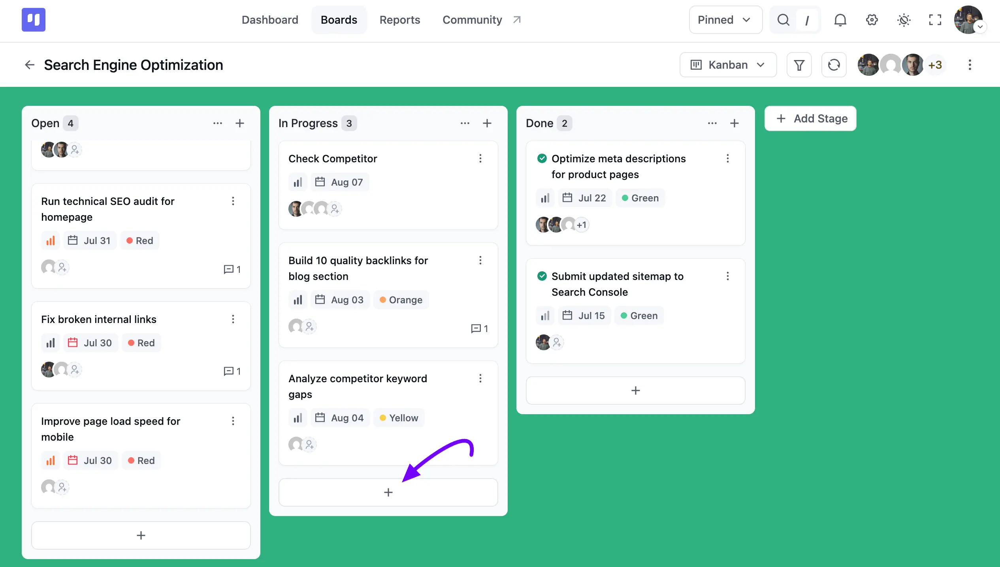
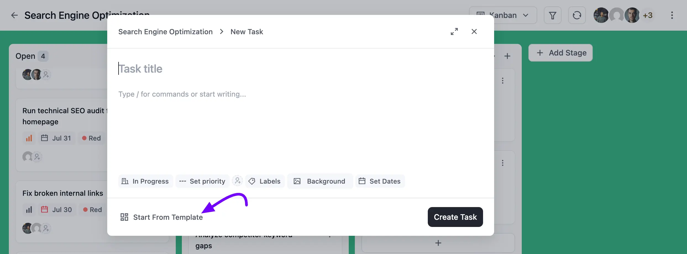
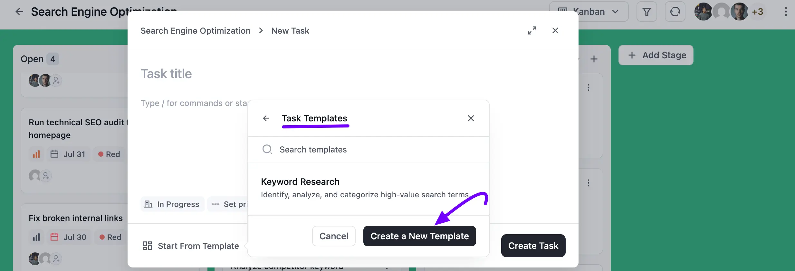

# Using Task Templates

You can turn any task into a reusable **Task Template**, so you don't have to rebuild the same task from scratch every time. In this guide, we'll show you how to create a template from an existing task, and how to start a new task from a template right in a stage.

## Creating a Template from an Existing Task

Open the task you want to turn into a template. Click on the **three-dot** icon at the top of the task details panel, then select **Make Template**.

Your task is now marked as a template. A banner appears at the top letting you know **This is a template task**. Click the **Create task from template** link to reuse it.

A **Templates** panel will appear. Update the **Task Title** if you'd like, and check the **Keep** boxes to carry over the template's **Labels** and **Assignees**. You can also pick a different **Stage** for the new task from the dropdown.

Once you're done, click the **Create Task** button to add the new task from your template.

## Starting a New Task Template from a Stage

You can also create a task template directly while adding a task to a stage.

Click the **Plus** icon at the bottom of any stage to open the quick-create task pop-up.

Click on **Start From Template** at the bottom of the pop-up.

A **Task Templates** panel will appear, listing any existing templates you've saved, like the **Keyword Research** template shown here. Simply click on a template to use it, or click **Create a New Template** to build one from scratch instead.

That's all you need to know about creating and using task templates in FluentBoards.
