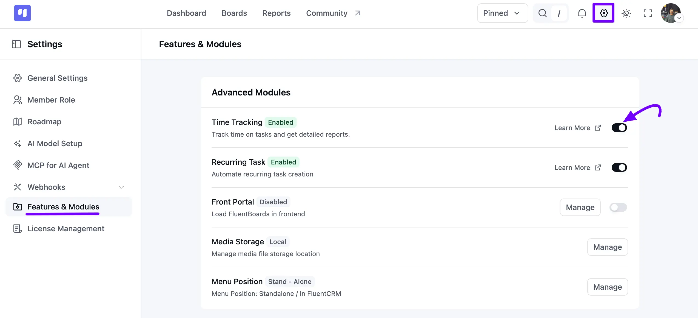
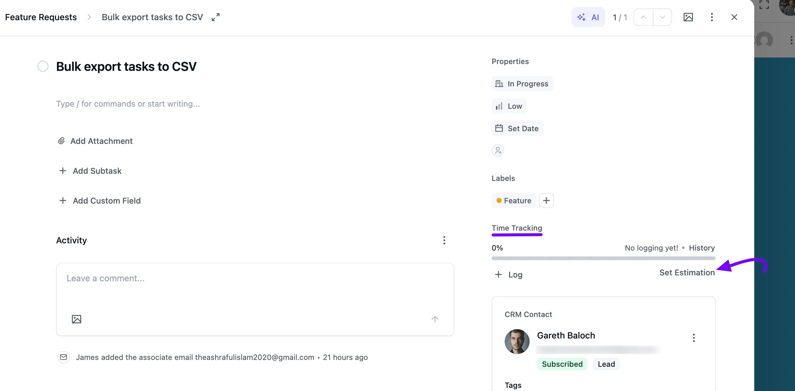
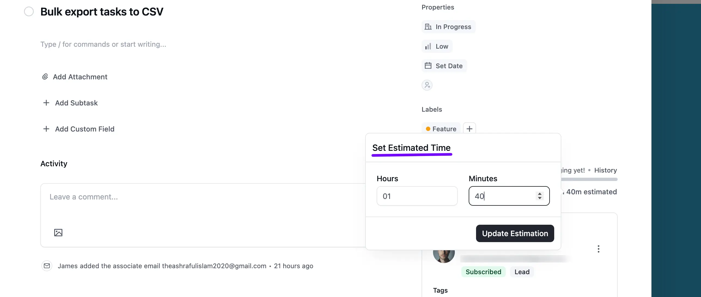
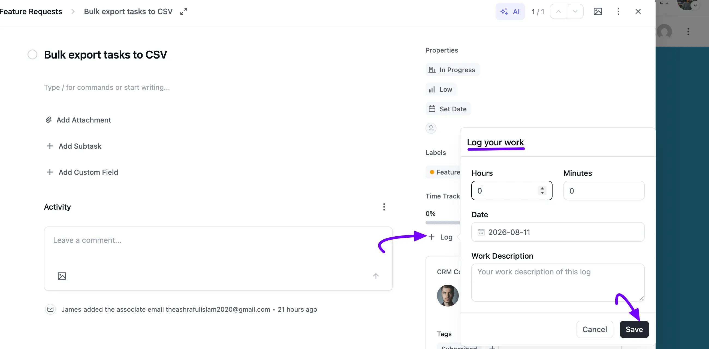
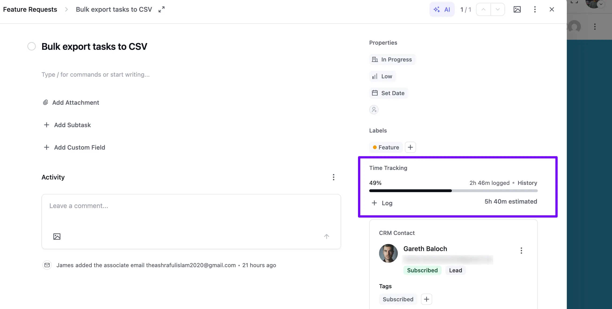

# Time Tracking

FluentBoards **Time Tracking** allows you to view a time log of your task work hours, along with descriptions that show task progress. This feature helps you determine effective work hours for project management.

In this guide, we will show you how to enable and how the Time Tracking feature works.

## Enable Time Tracking

To enable the time tracking module for your board tasks, go to your FluentBoards **Settings** and select **Features & Modules** from the left sidebar.

Under **Advanced Modules**, you will see the **Time Tracking** option. Click the **Toggle** button to enable it. Once enabled, the Time Tracking feature becomes active for your tasks.

## Time Tracking in Task

Now, open the specific task where you want to track time. In the **Properties** panel on the right, you will find a **Time Tracking** section showing a progress bar, along with **Log** and **Set Estimation** links.

### Set Estimate Time

Click on the **Set Estimation** link. A **Set Estimated Time** pop-up will appear. Enter the estimated **Hours** and **Minutes** required to complete the task, then click on the **Update Estimation** button.

### Set Log

Next, click the **+ Log** link to open the **Log your work** pop-up. Here, you can record the **Hours** and **Minutes** you've worked, the **Date**, and a **Work Description**. Once you've entered the details, click the **Save** button to save your log.

After that, the **Time Tracking** section updates to show your logged time as a percentage of your estimate, the total time logged so far, and the total time estimated for the task. Click **History** to review every log entry you've added.

> You'll also receive a Timesheet Report that's tailored to tasks and members within your boards. Dive into the [Reports](/fluentboard-reports) guide for further details.
